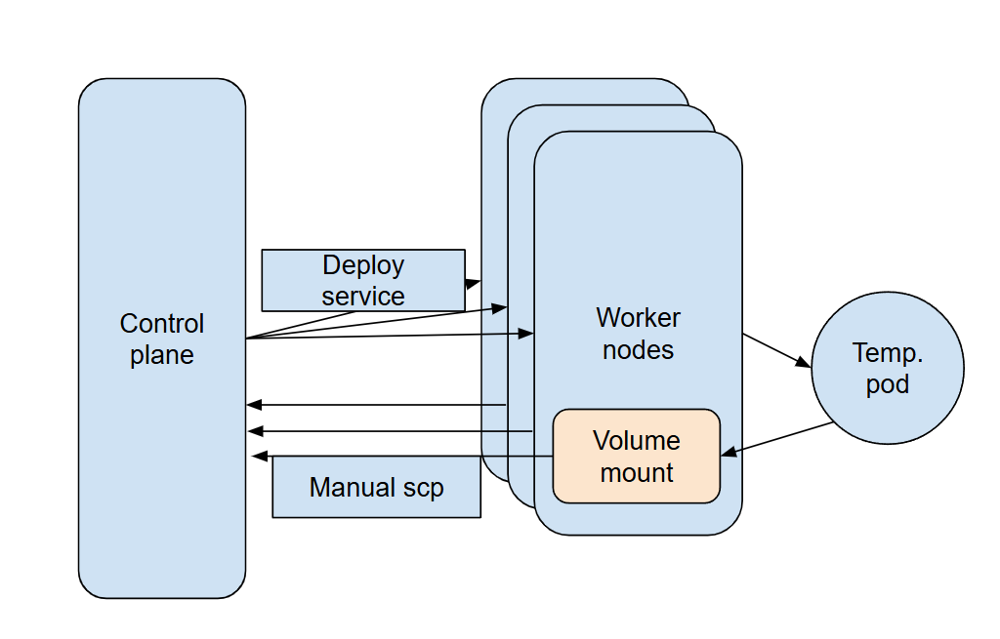
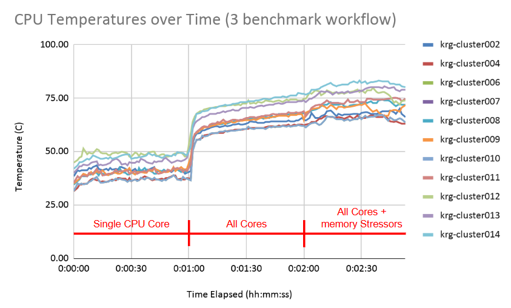
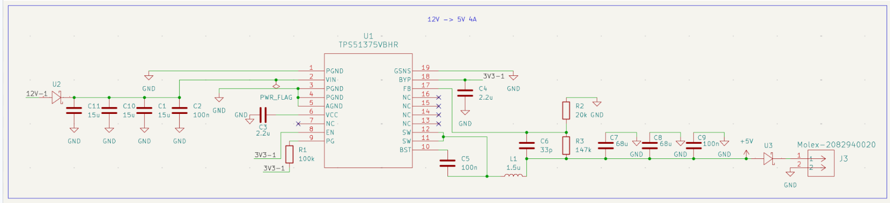
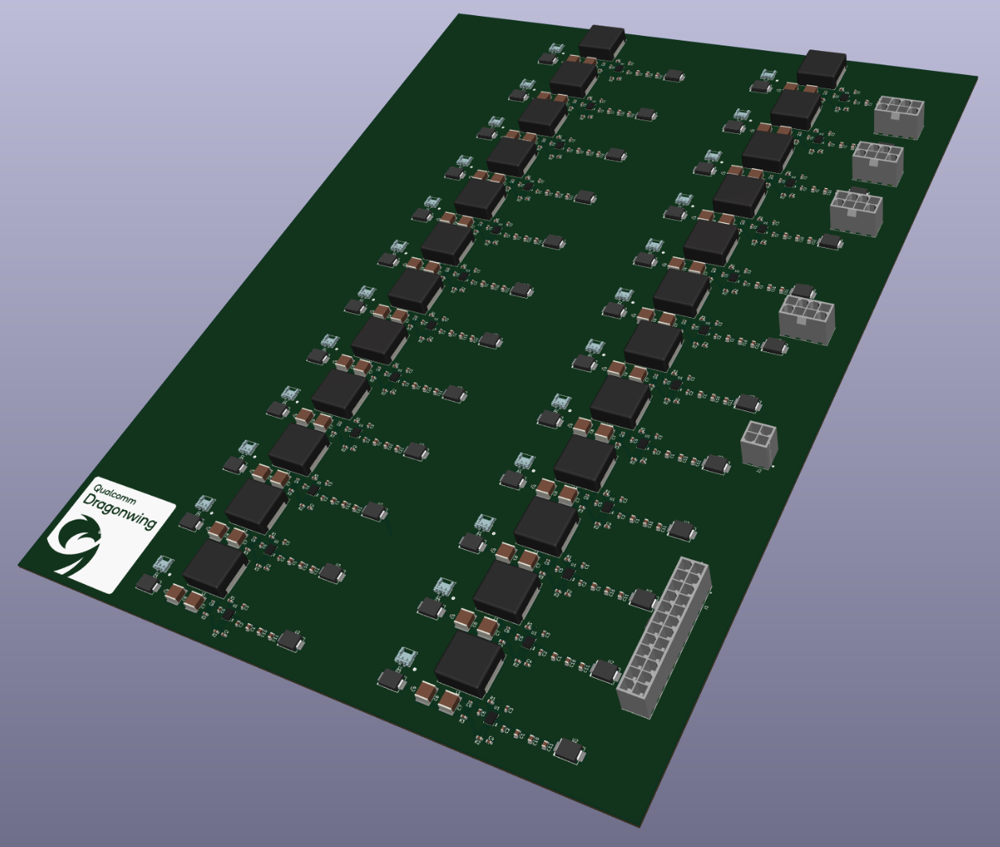

# Qualcomm Clustering

## Links

OpenCL Docker Image: https://github.com/KastnerRG/qualcomm-docker-image

Initial Proposal: https://github.com/KastnerRG/qualcomm-cluster

Autograder Setup: https://github.com/junkyard-computing/junkyard-autograder

Project Specification: https://docs.google.com/document/d/1bGuacAcaV2-XZTo-KWgVFfr9i1XaQ5Ia_mERNPMgnqo/edit?usp=sharing

Oral Report Presentation: https://docs.google.com/presentation/d/1_RRs3qRQV2yop3uGqzG5ULQS8ev7lnmhPA6lSn4YTX0/edit?usp=sharing

Milestone Report: https://docs.google.com/document/d/1Z4VhqCuE6MwD5AjcHFxpnRuKAo-5iLU9fI9hVrGW4mo/edit?usp=sharing

Final Paper: https://docs.google.com/document/d/1dH8CYN58SQU-w7OyjANidXlXmKbemkgSUTwr2H1mZ5E/edit?usp=sharing

## Abstract

Embedded development boards such as the Rubik Pi 3, designed by Qualcomm, are powerful devices that, when joined together to form a unified cluster, can perform as an efficient and alternative way to construct a data server. Qualcomm is searching for a way to develop its own server cluster made up entirely of its Rubik Pi 3 development boards, to study how they perform in union, and what a Qualcomm Cluster is capable of doing when put together. Server clusters, such as the one we're developing, take advantage of an array of computing nodes to balance workloads and manage the resources available to them when running tasks. We have continued to develop on this idea by preparing for the assembly of a V1 of the Qualcomm Cluster, building off of the current V0 that only contains 14 Rubik Pis, a rudimentary/inefficient power system, and an oversized chassis. Our progress on V1 of the Qualcomm Cluster consists of preliminary testing/documentation on 5V GPIO power, which showed that the initial 15W for testing resulted in shutdown during stress testing, and a new power system proposal consisting of a power distribution PCB and PiHats to distribute 20W to a potential full tray system of 24 Rubik Pis, complete with a bill of materials needed. We have also conducted testing and benchmarking of the current V0 of the Qualcomm Cluster to provide some data/results on how an early iteration of the cluster handles workloads.

## Introduction

Embedded development boards such as the Rubik Pi 3, designed by Qualcomm, are powerful devices that, when joined together to form a unified cluster, can perform as an efficient and alternative way to construct a data server. Server clusters, such as the one we're developing, leverage an array of computing nodes to balance workloads and manage the resources available to them during task execution. Qualcomm, in particular, has provided a large number of its Rubik Pi 3 devices for various projects at UC San Diego, with our project being one of them. The idea fueling our project is to create an experimental Qualcomm-sponsored server cluster, using their devices, that takes advantage of the benefits of using a multi-node system to compute and run tasks like any other server systems. 

Open-source distributed systems projects like these open new educational opportunities in university-level computer science courses. The Kastner Research Group built a [proof-of-concept cluster of 14 Rubik Pis](https://github.com/KastnerRG/qualcomm-cluster) and experimented with its abilities in the winter of 2026 in CSE 160: Introduction to Parallel Programming. Students were scored based on their algorithms’ performances on multiple hardware platforms, including the Rubik Pi cluster, presenting the opportunity and challenge to build generalized hardware-compliant code, and valuable experience in real-world embedded systems development. The cluster succeeded as a proof of concept, but hardware constraints, as well as the pure magnitude of student submissions, made the setup unreliable, prone to crashing, and ultimately infeasible in practice.

To meet the larger-scale objectives of this project, there is a goal of eventually being able to create a full server rack composed of hundreds of Rubik Pis working as one cluster to compute and handle workloads like any other server rack. This allows Qualcomm to not only develop their own cluster running on their designed microcomputers, but also provides them with data and research on how their Rubik Pis work individually and in a cluster setting.

For our purposes, the scope of the project focused on creating the blueprint for a design that could support a full tray of 24 Rubik Pis and testing of the current prototype Qualcomm Cluster. Scaling plans are outside the scope of the milestones and MVP we proposed, with our current team of students instead hoping to finalize work on V0 of the cluster, and propose a design for V1 of the cluster that we could validate before fully implementing a fully manufactured V1 Qualcomm Cluster. Our project sought to improve a variety of issues that V0 of the cluster currently has, a V1 design that provides a cheaper and more efficient power system, a new compact chassis, improved cooling, and support for 24 Rubik Pis.

## Setup

2 additional folders store the files used to progress this project in different ways. The hardware folder contains anything related to the development of the power system, including PCB files and spreadsheets related to the testing of 5V GPIO on the Rubik Pi. The software folder contains any scripts or data from benchmarking of the V0 cluster.

## Benchmarking

Benchmarking Suite: https://github.com/AlainZhangStudent/cse199-benchmarking-scripts

Kubernetes-Friendly Deploy: https://github.com/SirPuddinlot/qcluster-benchmarks-scripts/tree/mraysu

Version 0 Collected Metrics: https://drive.google.com/file/d/1UJVtf90dQDXijVFVBeuZRzG52QzeNRxQ/view

### Deployment Service: `benchmark-ds.yaml`

A key challenge of this project is ensuring electrical stability across entire trays of Rubik Pis powered by a single power supply. Alongside individual Rubik Pis' power draw and performance metrics, we test collective Rubik Pi performance at scale. We have developed and maintained a repository of benchmark and metric collection scripts. Creating our own automation benefits us by granting greater granular control over benchmark types and configurations, and metric data format and resolution. We create a deployment service kubernetes configuration that can simultaneously deploy these benchmarks to all running nodes, one pod per node. By running all nodes simultaneously, we can emulate a performance-demanding workload on the cluster and collect timestamped node-level metrics.

    High-level Diagram
    
    

## Power Distribution Board

The main power distribution board is composed of 24 buck converter circuits, taking input from the 12V power lines on various cables connected to our PSU, and stepping it down to 5V/4A to power each individual Rubik Pi in the cluster. This PCB takes advantage of the 20+4 pin motherboard cable, 4x4 pin CPU cable, and four 6+2 pin PCI-e cables to split up 62A of current from the 12V power line between all the buck converters to prevent overloading on the circuit. The 20+4 pin motherboard cable also provides 3.3V power for miscellaneous functions, such as the enable pins on the buck converter chips. For each buck converter circuit, 12V of power goes through a protection diode and some pull-down capacitors in parallel before reaching the Texas Instruments TPS51375VBHR buck converter chip. The 5V output is sent through an inductor and more pull-down resistors for stability. A final protection diode was added for extra safety. Our bill of materials lists 6 different capacitor values, 3 different resistor values, an inductor, and safety diodes at both the input and output of the circuit. This PCB will also utilize 2oz of copper for traces to be able to handle the high current going through. Exact mounting is still tentative, so specific screw hole sizes may be added at a later time.

## Team Members

- Aarnav Gujjari - CSE 145 Student
- Alain Zhang - CSE 199 Student
- Ferrari Guan
- Michael Sullivan- CSE 145 Student
- Yian Zhuang - CSE 145 Student
- Yves Mojica - CSE 145 Student
